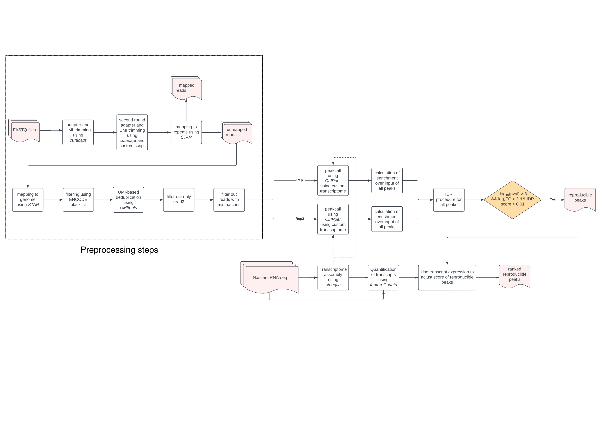

# Custom analysis pipeline for enhanced Cross-linking and Immunoprecipitation (eCLIP) analysis

Running enhanced CLIP analysis on HPC cluster with PBS Pro

## Description

The key adaptations of this workflow are:
* we provide a custom transcriptome, which was assembled using RNA-seq data generated in-house. This expands the domain in which eCLIP peaks can be called, thereby greatly increasing the sensitivity of the peakcalling. Very relevant for RBPs that bind to noncoding RNAs;
* We adjust the score of the peaks called by the peakcaller. The score of the peaks from the peakcaller can be misleading because eCLIP peak intensity is directly affected by the abundance of the RNA species and thus may not represent 'significant binding';
* The initial motif search strategy constructs a background that is composed of the peak summit itself while the foreground is flanking the peaks. This approach was adopted due to the nature of the eCLIP method (schematic todo).

This repo contains the scripts needed from start to finish
Note that the peakcaller depends on an annotation for peakcalling, so eCLIP signal that doens't fall in the bounds of the transcriptome is lost.
So, we need to make our own transcriptome, and provide it to CLIPper.

* preprocessing - UMI extraction, adapter trimming, mapping to human genome
* peakcalling - generate custom annotation for peakcaller, call peaks using CLIPpers [IDR](https://www.encodeproject.org/pipelines/ENCPL357ADL/)
* peakcalling_2 - calibrate scores of called peaks for final ranking, de-novo motif search

The peak calling models reads on a transcript to a poisson distribution in order to call peaks, with parameter equal to read count per unit length - see [here](https://github.com/YeoLab/clipper/blob/master/clipper/src/call_peak.py). 

The score calibration adjusts the score of a peak (the -log10 p-value) by the abundance of the underlying transcript. 

## Misc

* [Brian Yee's CLIPper docker images](https://hub.docker.com/r/brianyee/clipper/) - Used for peak calling
* [Brian Yee's IDR docker images](https://hub.docker.com/r/brianyee/merge_peaks/) - Used for calculation of enrichment and IDR

## Overview

